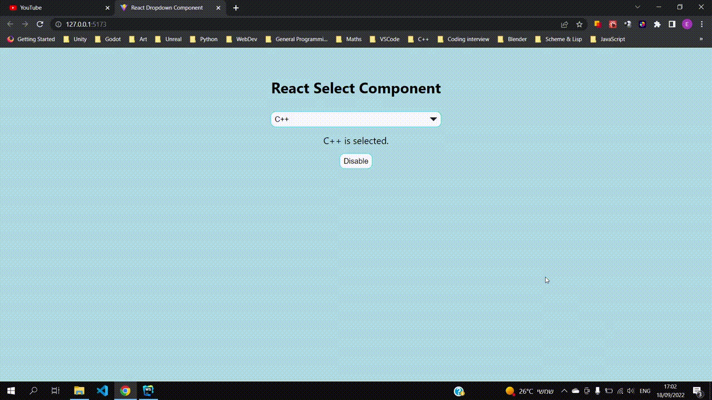

# Dropdown Component for React

A dropdown menu component for React, written in TypeScript.

## Notes

- Based on a method demonstrated
in [this blog post](https://towardsdev.com/how-to-create-an-accessible-custom-select-dropdown-in-react-9d9858415f10)
.

